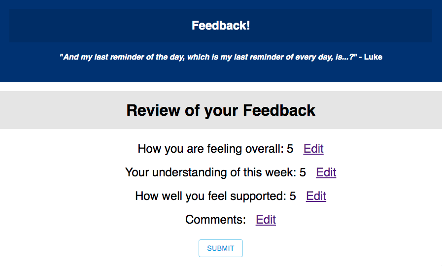

# Redux Feedback Loop

### SETUP

Create your database and tables using the provided `data.sql` file. Start the server.

```
npm install
npm run server
```

Now that the server is running, open a new terminal tab with `cmd + t` and start the react client app.

```
npm run client
```

### ADD NEW FEEDBACK

The app starts at a base page where the user sees their first question regarding feedback after their day at work/school. After answering how they are feeling overall using radio buttons on a 1-5 scale, they will be directed to the next view which asks them to rate their understanding of the day's material. From there the have the option to go back and change their rating or continue on to answer how they feel they are being supported.  

After answering, they are able to add optional comments and finally they are guided to the review page where the user is able to see all of their answers and comments and perform a final submit. Upon submit they are given a thank you if the submit was successful and an opportunity to add new feedback.

### Features

This app has input validation in which the user is not allowed to move on to the next page unless they have filled out the appropriate form.

The user can navigate back and forth between views to make changes to their answers and on the final review page is able to relocate to any page to change an answer.  A user is also provided a prompt on what their last rating was in case they forgot. 

Finally there is an admin page in which the administrator can review all feedback that has been submitted thus far and has the option to clear one or all of them as well as flag those that need to be followed up on. 

### Software used

This is a react app that uses redux and a router to sift through views while still maintaining user added data as well as express as well as SQL to keep track of submitted feedback.

Material-ui is used for styling.


# Views

### Radio Form


### Comments


### Review


### Admin


- Deploy your project to Heroku -- you'll need to read the special instructions for building and deploying with these apps! 
